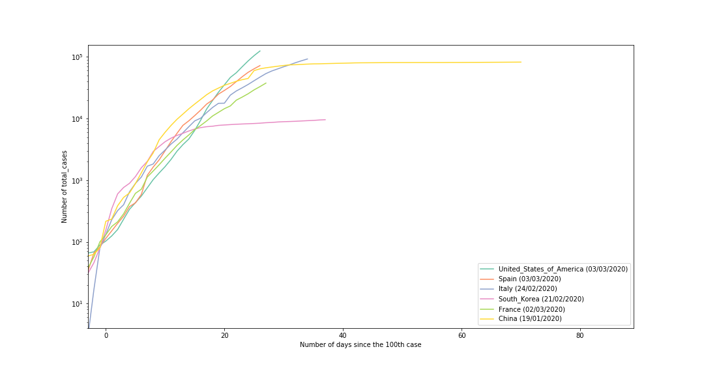
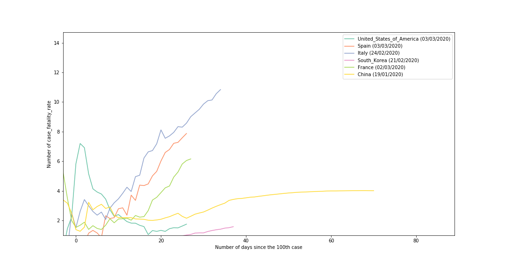
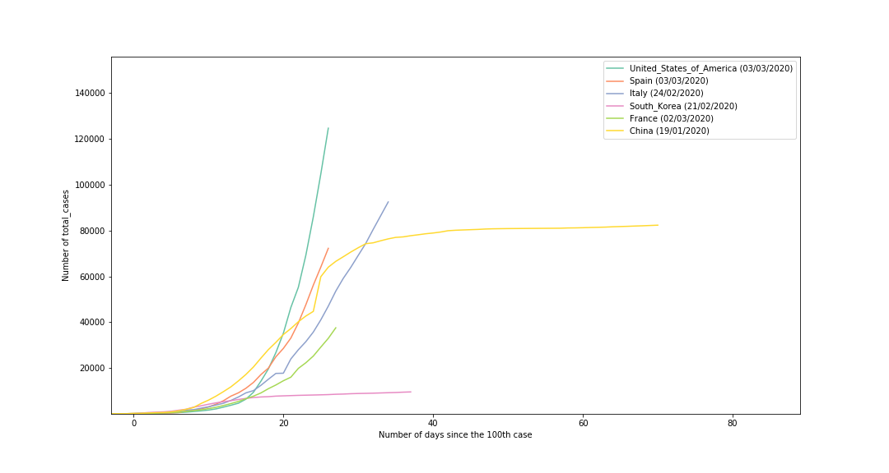
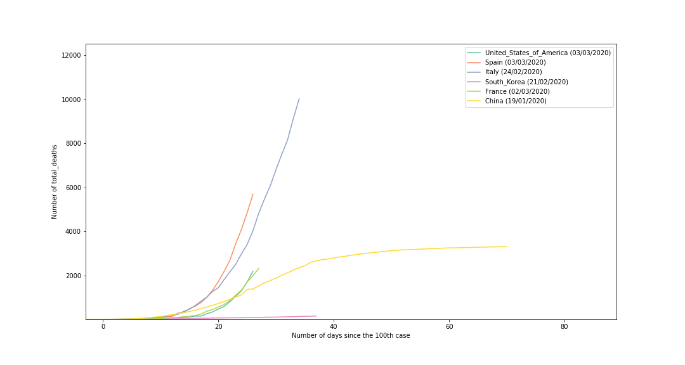

# COVID-19 - New case and death rate / Morbidity

We only use ECDC data source for now (c.f. [ourworldindata.org](https://ourworldindata.org/coronavirus#why-we-stopped-relying-on-data-from-the-world-health-organization)
* [European Centre for Disease Prevention and Control (ECDC)](https://www.ecdc.europa.eu/en/publications-data/download-todays-data-geographic-distribution-covid-19-cases-worldwide)

The date are shifted to have a day-0 for each country corresponding to the first *x* cases indicated in the ECDC dataset.

These *start dates* are indicated in the legend for each graph.

All the code is in the notebook of this repository. [Run and Edit in Google Colab](https://colab.research.google.com/github/bmaingret/covid-19/blob/master/COVID-19.ipynb)

## Graphs as of 29/03/2020

### Total cases 

### Total deaths

### Morbidity (%of deaths per total cases)

### Total cases (linear y-axis)

### Total deaths (linear y-axis)

